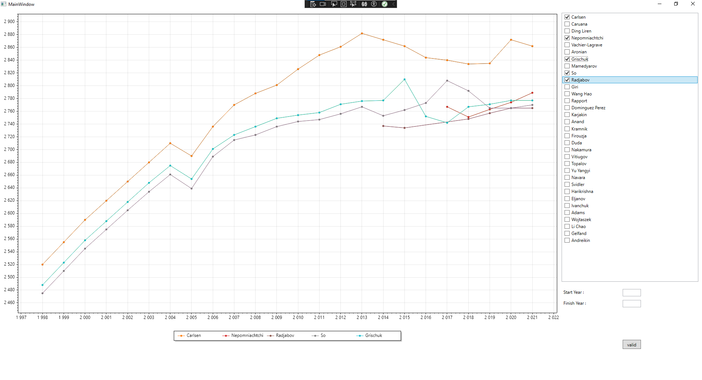

# Plot-That-Line

## Description
This program will display statistics on the level of players each year from a csv file

## How to use it 
### CSV File
The csv file must have 3 columns: Name, ELO, and Year. 
Each line have ot separe elements by ";".

### Program
When you start the program, you have to import a csv file and then you can show a graphic. 
In the graphic you can filter by date and chose what play will be show.

## Auteur
| <h3>[@TiaSous](https://github.com/TiaSous) </h3> |
| ------------- |
| |